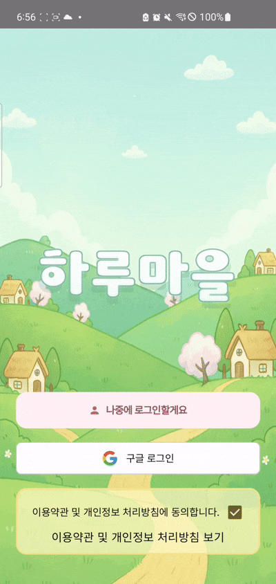
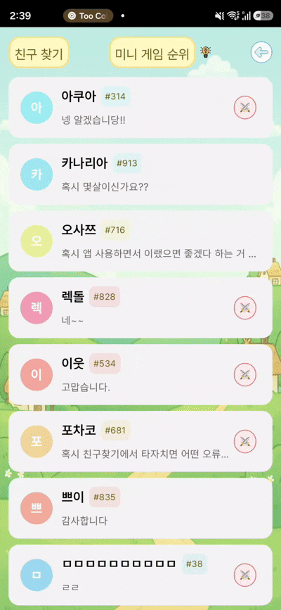
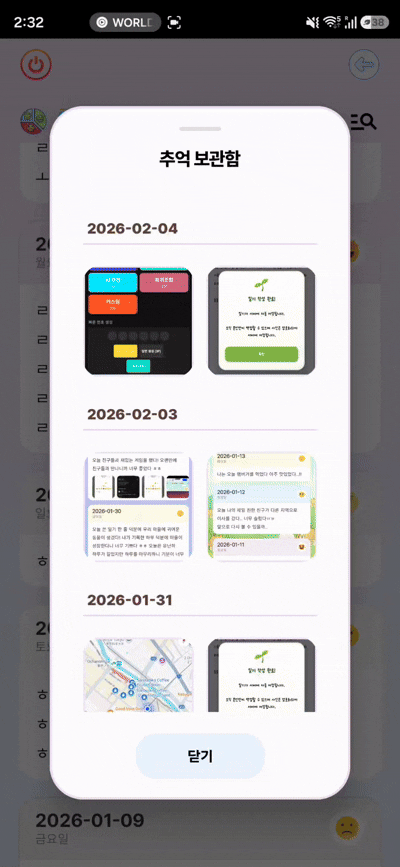
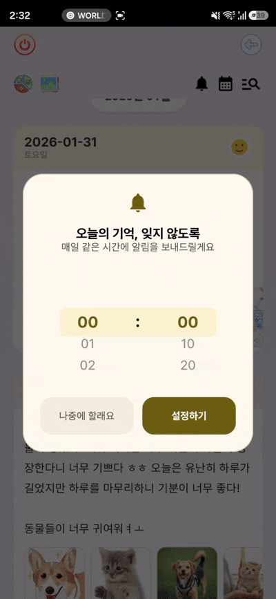
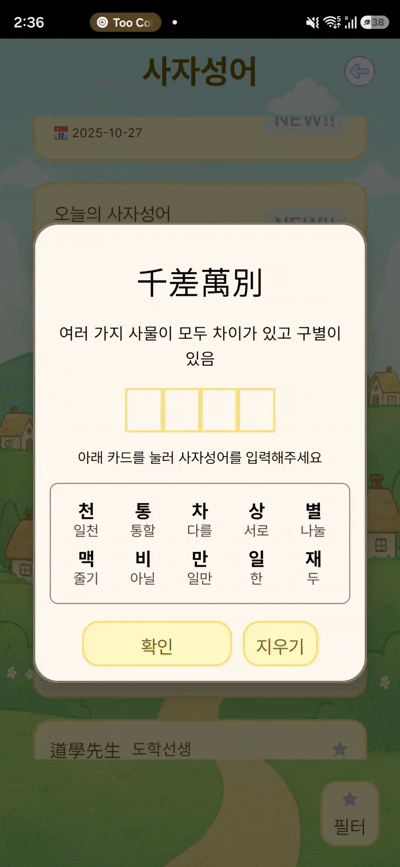
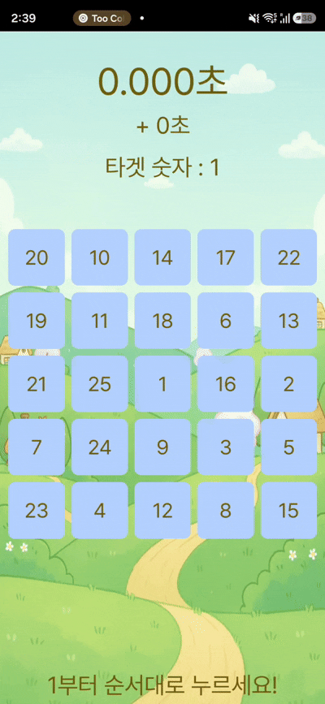
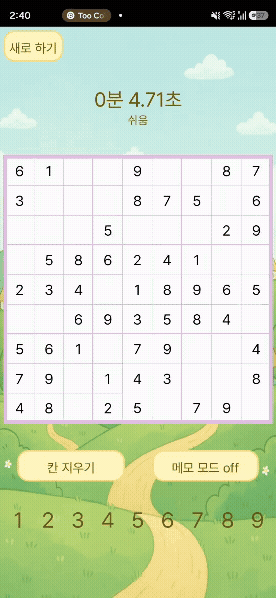
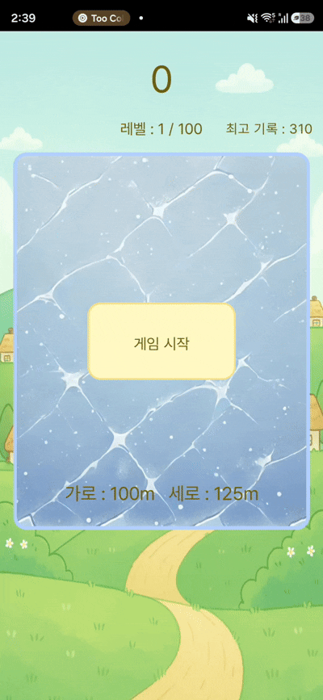

# 🏡 하루마을 (HaruVillage)

<p align="center">
  
  
  
  
  
  
</p>

> 하루를 기록하고, 나만의 마을을 가꾸는 생활 습관 형성 안드로이드 앱

매일의 일상을 일기로 남기고, 그 활동을 통해 얻은 재화로 마을을 꾸며가는 **게이미피케이션 기반 커뮤니티 앱**입니다.
단순 기록을 넘어 **성취감**과 **따뜻한 소통**을 함께 제공하는 공간을 지향합니다.

---

## 📈 주요 성과

| 항목 | 수치 |
|------|------|
| 🏪 운영 기간 | Google Play Store 정식 출시 후 **1년 9개월** |
| 📥 누적 다운로드 | **1,400+** |
| ⭐ 사용자 평점 | **4.9+** (리뷰 100+) |
| 🔄 업데이트 | 사용자 피드백 기반 지속적 업데이트 진행 중 |

---

## 🎬 앱 구동 화면

<table>
  <tr>
    <td align="center"><br/><b>로그인</b><br/><sub>설치 즉시 게스트로 시작, 언제든 Google 계정으로 업그레이드</sub></td>
    <td align="center"><br/><b>내정보</b><br/><sub>칭호·인삿말을 설정해 나만의 프로필로 이웃에게 소개</sub></td>
    <td align="center"><br/><b>글씨체 변경</b><br/><sub>취향에 맞는 폰트로 앱 전체 분위기를 한 번에 변경</sub></td>
  </tr>
  <tr>
    <td align="center"><br/><b>마을 꾸미기</b><br/><sub>활동으로 모은 재화로 배경·건물·장식을 자유롭게 배치</sub></td>
    <td align="center"><br/><b>맵 도감</b><br/><sub>수집한 맵과 미보유 맵을 한눈에 확인</sub></td>
    <td align="center"><br/><b>펫 도감</b><br/><sub>보유한 펫과 미수집 펫을 도감 형식으로 탐색</sub></td>
  </tr>
  <tr>
    <td align="center"><br/><b>펫 뽑기</b><br/><sub>재화를 사용해 새로운 펫을 뽑는 설렘</sub></td>
    <td align="center"><br/><b>펫 키우기</b><br/><sub>매일 펫에게 밥을 주고 상호작용하며 함께 성장</sub></td>
    <td align="center"><br/><b>이웃마을</b><br/><sub>이웃의 마을을 방문해 꾸밈새를 구경하고 인사 나누기</sub></td>
  </tr>
  <tr>
    <td align="center"><br/><b>전체채팅</b><br/><sub>모든 주민과 실시간으로 자유롭게 대화</sub></td>
    <td align="center"><br/><b>개인채팅</b><br/><sub>마음이 맞는 이웃과 1:1로 조용히 대화</sub></td>
    <td align="center"><br/><b>일기 달력</b><br/><sub>달력으로 지난 일기를 한눈에 되돌아보기</sub></td>
  </tr>
  <tr>
    <td align="center"><br/><b>감정 필터</b><br/><sub>기분별로 일기를 걸러 내 감정 패턴 돌아보기</sub></td>
    <td align="center"><br/><b>사진보관함</b><br/><sub>일기에 남긴 사진들을 갤러리처럼 모아서 감상</sub></td>
    <td align="center"><br/><b>알림</b><br/><sub>원하는 시간에 알림을 받아 꾸준한 기록 습관 유지</sub></td>
  </tr>
  <tr>
    <td align="center"><br/><b>사자성어</b><br/><sub>매일 새로운 사자성어를 배우고 보상 획득</sub></td>
    <td align="center"><br/><b>영어 단어</b><br/><sub>짧은 시간 영어 단어를 학습하고 재화로 보상</sub></td>
    <td align="center"><br/><b>상식 퀴즈</b><br/><sub>다양한 분야의 상식 퀴즈로 지식을 넓히며 보상 획득</sub></td>
  </tr>
  <tr>
    <td align="center"><br/><b>숫자게임</b><br/><sub>숫자 조합으로 목표를 맞추는 두뇌 트레이닝</sub></td>
    <td align="center"><br/><b>스도쿠</b><br/><sub>난이도별 스도쿠로 집중력을 키우고 랭킹 도전</sub></td>
    <td align="center"><br/><b>컬링</b><br/><sub>손가락으로 즐기는 캐주얼 컬링 미니게임</sub></td>
  </tr>
</table>

---

## 🚀 핵심 기능

### 📓 스마트 다이어리
- 감정 아이콘 선택, 사진 첨부, 자유 텍스트 기록
- **자동 저장** 구조로 앱이 강제 종료되어도 작성 내용 보존
- 캘린더 뷰로 날짜별 일기 탐색, 감정 필터로 기분 패턴 분석
- 사진보관함에서 일기 속 사진을 갤러리처럼 한눈에 모아보기
- AlarmManager 기반 **맞춤 알림 예약**으로 꾸준한 기록 습관 형성

### 🏘️ 마을 꾸미기 & 게이미피케이션
- 일기 작성·걷기·학습·미니게임 등 다양한 활동으로 인앱 재화(햇살) 획득
- 재화로 배경, 건물, 장식 아이템 구매 및 자유 배치
- **맵 34종** 수집 가능, 맵마다 고유 BGM이 자동 적용
- **펫 36종** 수집·육성 시스템 (가챠 뽑기, 매일 밥 주기, 상호작용)
- **아이템 112종** 도감 완성 목표로 장기 플레이 유도
- 업적 **메달 시스템**으로 장기 리텐션 유도 (칭호 획득 및 프로필 표시)

### 🤖 AI 촌장
- OpenAI GPT-3.5-turbo 기반 AI 촌장이 접속할 때마다 따뜻한 인사말 생성
- OkHttp를 통한 REST API 호출, 응답 실패 시 폴백 메시지로 UX 보장

### 🚶 건강 관리
- Samsung Health Connect 연동으로 걸음 수 실시간 측정
- **Foreground Service** + 알림 채널로 백그라운드 상시 추적
- 하루 5,000보 달성 시 인앱 재화 보상 지급
- 주·월 단위 걸음 수 통계 차트 (YCharts) 제공
- 기기 재시작 후에도 **BootReceiver**로 서비스 자동 복구

### 👥 커뮤니티 & 소셜
- 사진 기반 게시판으로 일상 공유 (좋아요 · 댓글)
- Firestore 실시간 동기화 기반 **전체채팅** 및 **1:1 개인채팅**
- 이웃 추가 후 상대방 마을 직접 방문 가능
- 신고 및 차단 기능으로 건전한 커뮤니티 환경 유지

### 📚 학습 콘텐츠
- **사자성어**: 매일 새로운 사자성어 학습 + 뜻 확인
- **영어 단어**: 플래시카드 방식의 영단어 암기
- **상식 퀴즈**: 역사·과학·문화 등 다양한 분야 문제
- **스도쿠**: Easy / Normal / Hard 3단계 난이도, 글로벌 랭킹 집계
- 학습 완료 시 인앱 재화 보상 자동 지급

### 🎮 미니게임
- **숫자게임**: 제한 시간 내 숫자 조합으로 목표 수치 달성
- **스도쿠**: 난이도별 퍼즐, 클리어 기록으로 랭킹 경쟁
- **컬링**: 손가락 스와이프로 즐기는 캐주얼 물리 게임
- 전체 게임 기록은 서버에 집계되어 **실시간 랭킹** 제공

### 🎨 개인화 & 설정
- 앱 전체에 적용되는 **글씨체(폰트) 변경** 기능 (SharedPreferences 기반)
- 인삿말·칭호 커스터마이징으로 나만의 프로필 완성
- 다크/라이트 모드 대응

### 🔐 계정 관리
- **게스트(익명) 로그인**으로 설치 즉시 별도 가입 없이 시작
- **Google 소셜 로그인** 지원 (Firebase Auth)
- 게스트 → 정식 계정 **무중단 업그레이드** (데이터 이관 포함)

---

## 🛠 기술 스택

| 분류 | 기술 |
|------|------|
| **언어** | Kotlin |
| **UI** | Jetpack Compose, Material 3, Lottie |
| **아키텍처** | Clean Architecture, MVVM + MVI (Orbit) |
| **비동기** | Kotlin Coroutines, Flow |
| **로컬 DB** | Room Database (14 Entity, Migration v1→v4) |
| **백엔드** | Firebase (Auth / Firestore / Storage / Analytics / FCM) |
| **서버** | Spring Boot + MySQL (랭킹·공지 API, 마이그레이션 진행 중) |
| **네트워크** | Retrofit 2, OkHttp |
| **AI** | OpenAI GPT-3.5-turbo (OkHttp REST), Google Generative AI SDK |
| **DI** | Dagger Hilt |
| **백그라운드** | WorkManager, ForegroundService, AlarmManager, BootReceiver |
| **헬스** | Samsung Health Connect |
| **지도** | Kakao Maps SDK, Kakao REST API |
| **이미지** | Coil, Firebase Storage |
| **차트** | YCharts |

---

## 🏗️ 아키텍처


```
Presentation Layer
├── Jetpack Compose (UI)
└── ViewModel (MVVM + MVI via Orbit)
    └── Event → Intent → State → UI (단방향 데이터 흐름)

Data Layer
├── Room Database (로컬 캐싱, 오프라인 지원)
│   └── 14 Entity: User, Diary, Walk, Item, World, Pat,
│                   Photo, English, KoreanIdiom, Letter,
│                   AllUser, Area, Knowledge, Sudoku
├── Firebase (Auth, Firestore, Storage, FCM)
├── Spring Boot API (랭킹, 공지사항)
└── OpenAI API (AI 촌장 인사)

DI: Dagger Hilt
Background: WorkManager / ForegroundService / AlarmManager / BootReceiver
```

**오프라인 우선 설계**: Room에 먼저 저장 후 Firestore로 동기화 → 네트워크 없이도 정상 동작, 연결 복구 시 자동 업로드

**단방향 데이터 흐름 (MVI)**: UI 이벤트 → ViewModel Intent → State 변경 → UI 리컴포즈, 상태 역류 없음으로 예측 가능한 UI 보장

---

## 🔥 기술적 고민 & 해결

### 1. 다이어리 작성 중 데이터 유실 방지
- **문제**: 작성 완료 전 앱이 종료되면 내용이 사라지는 UX 이슈
- **해결**: Flow collector로 입력 이벤트를 구독하여 Room에 즉시 로컬 저장 → 완료 시 Firestore 업로드하는 2단계 저장 구조로 변경

### 2. Firebase의 복잡한 쿼리 한계
- **문제**: 랭킹, 통계 등 복잡한 집계 쿼리를 Firestore에서 처리하기 어려움
- **해결**: Spring Boot + MySQL 기반 API 서버로 단계적 마이그레이션 진행 중 (MSA 구조 학습 및 적용)

### 3. DB 스키마 변경 시 사용자 데이터 유실 위험
- **문제**: 앱 업데이트로 Room 스키마가 변경될 때 기존 설치 사용자 데이터 파괴 가능성
- **해결**: Room Migration 스크립트(v1 → v2 → v3 → v4) 작성으로 기존 데이터를 보존하면서 무중단 업그레이드

### 4. 백그라운드 걸음 수 추적 서비스 종료 문제
- **문제**: Android OS의 배터리 최적화로 백그라운드 서비스가 강제 종료됨
- **해결**: ForegroundService + 알림 채널 등록으로 시스템 종료 방지, BootReceiver로 기기 재시작 시 자동 복구

### 5. 게스트 → 정식 계정 전환 시 데이터 이관
- **문제**: 익명 계정으로 플레이한 데이터를 Google 계정 전환 후에도 유지해야 함
- **해결**: Firebase Auth의 `linkWithCredential`을 활용해 기존 UID를 유지한 채 Google 계정 연동, Room 및 Firestore 데이터 무결성 보장

### 6. 실시간 채팅 메시지 순서 보장
- **문제**: Firestore 실시간 리스너가 여러 클라이언트에서 동시에 수신될 때 메시지 순서가 뒤섞이는 경우 발생
- **해결**: 메시지 문서에 서버 타임스탬프(`FieldValue.serverTimestamp()`)를 기록하고 클라이언트에서 timestamp 기준 정렬, 낙관적 UI 업데이트로 체감 지연 최소화

### 7. 폰트 전역 적용 시 Compose 리컴포즈 최소화
- **문제**: 앱 전체 폰트 변경 시 모든 컴포저블이 불필요하게 리컴포즈되는 성능 이슈
- **해결**: SharedPreferences에 선택 폰트 저장 후 앱 재시작 시 최상위 `MaterialTheme`의 `Typography`에만 적용, 변경 범위를 테마 레벨로 한정하여 불필요한 리컴포즈 방지

---

## 📁 프로젝트 구조

```
app/src/main/java/com/a0100019/mypat/
├── data/
│   └── room/
│       ├── user/          # 사용자 정보, 재화, 설정
│       ├── diary/         # 일기 데이터
│       ├── walk/          # 걸음 수 기록
│       ├── pat/           # 펫 데이터
│       ├── item/          # 아이템 도감
│       ├── world/         # 마을 배치 정보
│       ├── area/          # 맵 데이터
│       ├── photo/         # 사진 게시판
│       ├── allUser/       # 전체 유저 랭킹 데이터
│       ├── english/       # 영어 단어 학습
│       ├── koreanIdiom/   # 사자성어 학습
│       ├── knowledge/     # 상식 퀴즈
│       ├── sudoku/        # 스도쿠 퍼즐
│       └── letter/        # 채팅 메시지
└── presentation/
    ├── main/              # 메인 마을 화면
    ├── diary/             # 일기 작성·조회
    ├── neighbor/          # 이웃·커뮤니티
    ├── activity/          # 활동 (걷기·학습·게임)
    │   ├── daily/         # 일일 활동
    │   ├── game/          # 미니게임
    │   └── information/   # 내 정보·랭킹
    └── loading/           # 앱 초기화·로그인
```

---

## 💻 설치 및 실행

```bash
git clone https://github.com/a0100019/HaruVillage-Android-Official.git
```

1. **Android Studio** (Hedgehog 이상)에서 프로젝트 열기
2. **Firebase** 프로젝트 생성 후 `google-services.json`을 `app/` 폴더에 추가
3. `local.properties`에 아래 API 키 설정
   ```
   OPENAI_API_KEY=your_openai_key
   KAKAO_API_KEY=your_kakao_key
   ```
4. Samsung Health Connect 앱이 기기에 설치되어 있어야 걸음 수 연동 가능
5. **Run ▶️**

> ⚠️ API 키가 없는 경우 AI 촌장 인사 및 걸음 수 기능은 동작하지 않지만, 나머지 기능은 정상 이용 가능합니다.

---

## 🔗 링크

- [Google Play Store](https://play.google.com/store/apps/details?id=com.a0100019.mypat)
